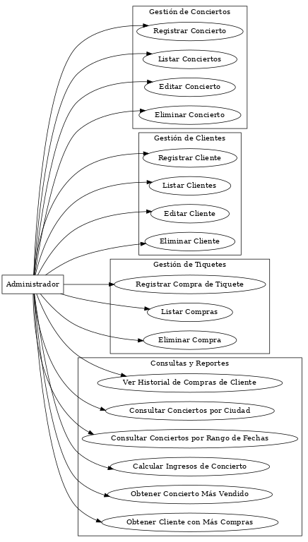
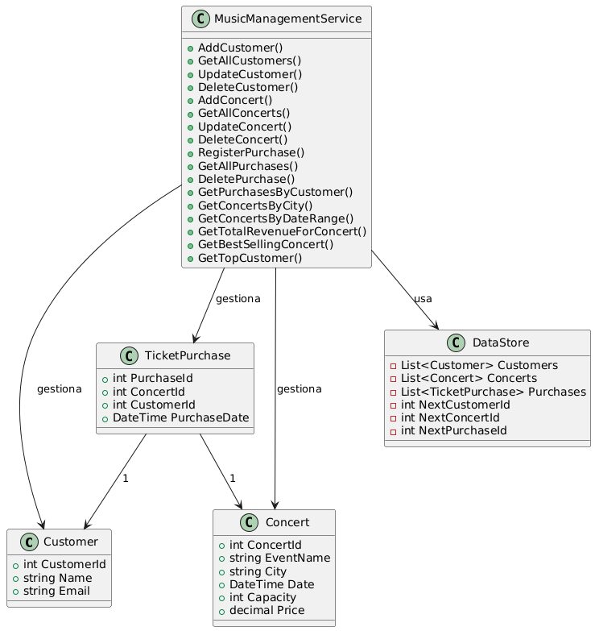

# 🎼 RiwiMusic

Un sistema de gestión de conciertos y ventas de tiquetes desarrollado en **C\#** 🚀.

**RiwiMusic** es una aplicación de consola que simula un sistema de administración para conciertos, permitiendo la gestión de eventos, clientes y la venta de tiquetes. Está diseñado para ser un ejemplo práctico del uso de la **programación orientada a objetos (POO)**, la gestión de colecciones y el uso de consultas **LINQ** en un entorno .NET.

## 🌟 Características Principales

  * **Gestión de Conciertos**: Crea, edita, lista y elimina información de conciertos (nombre del evento, ciudad, fecha, capacidad, precio).
  * **Gestión de Clientes**: Administra los datos de los clientes (nombre y email).
  * **Gestión de Tiquetes**: Registra compras de tiquetes, asegurando que no se supere la capacidad de los conciertos.
  * **Consultas Avanzadas**: Utiliza LINQ para realizar reportes y búsquedas complejas, como:
      * Historial de compras de un cliente.
      * Búsqueda de conciertos por ciudad o rango de fechas.
      * Cálculo de ingresos totales por concierto.
      * Identificación del concierto más vendido y el cliente con más compras.

## 📁 Estructura del Proyecto

El código está organizado en las siguientes capas lógicas, un enfoque común en el desarrollo de software para mejorar la **modularidad** y la **mantenibilidad**:

  * `Models/`: Contiene las clases de datos o "entidades" del sistema: `Concert.cs`, `Customer.cs` y `TicketPurchase.cs`. Estas clases representan la información de forma estructurada.
  * `Data/`: La clase `DataStore.cs` actúa como una base de datos en memoria. Almacena las listas de clientes, conciertos y compras.
  * `Services/`: La clase `MusicManagementService.cs` alberga toda la **lógica de negocio**. Contiene los métodos para crear, leer, actualizar y eliminar (`CRUD`) los datos, así como las consultas avanzadas.
  * `Program.cs`: La capa de **presentación** o la interfaz de usuario. Contiene el bucle principal del programa y la lógica para interactuar con el usuario a través de la consola, llamando a los métodos de la capa `Services`.

-----

## UML - Diagramas del Sistema

Antes de la implementación, el sistema fue diseñado utilizando diagramas UML para visualizar sus componentes y sus interacciones.

### Diagrama de Casos de Uso

Este diagrama muestra cómo el **Administrador** interactúa con el sistema, delineando todas las funcionalidades clave desde la perspectiva del usuario.



### Diagrama de Clases

Este diagrama representa la estructura estática del proyecto, mostrando las clases principales, sus atributos y las relaciones entre ellas. Define la lógica del negocio en la clase **`MusicManagementService`** y la estructura de datos en **`DataStore`**, que interactúan con las clases de modelos como **`Customer`**, **`Concert`** y **`TicketPurchase`**.



-----

## ⚙️ Requisitos del Sistema

  * **.NET SDK**: Asegúrate de tener instalado el SDK de .NET. Puedes descargarlo desde el [sitio oficial de Microsoft](https://dotnet.microsoft.com/download).

## 🚀 Cómo Usarlo

1.  **Clona el repositorio** o descarga los archivos.
2.  **Abre una terminal** en la carpeta principal del proyecto.
3.  **Ejecuta la aplicación** con el siguiente comando:

<!-- end list -->

```bash
dotnet run
```

4.  ¡Sigue las instrucciones del **menú en la consola** para comenzar a interactuar con el sistema\!
